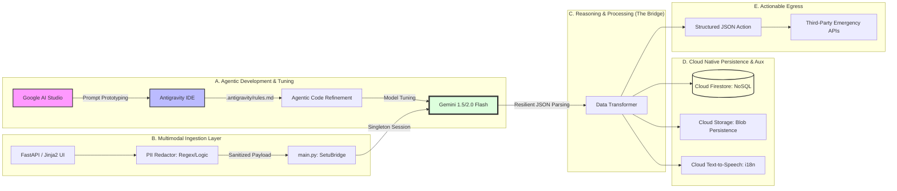

# Project Setu (सेतु) 🌉

### The Universal AI Bridge for Indian Societal Benefit

[](https://cloud.google.com/)
[](https://deepmind.google/technologies/gemini/)
[](https://fastapi.tiangolo.com/)

**Project Setu (सेतु)** is a Gemini-powered "Universal Bridge" designed to close the gap between chaotic, unstructured human intent and rigid, structured emergency/healthcare systems in India.

In a crisis, data is never clean. Setu ingests "messy" real-world inputs — Hinglish voice notes, blurry prescription photos, or frantic disaster reports — and instantly converts them into **Structured, Verified, and Life-Saving Actions.**

---

## 🏗️ System Design Diagram



### 📜 Technical Writeup
## I. Project Philosophy
Project Setu is engineered as a Universal Bridge to solve the "Impedance Mismatch" between human chaos and system structure. In the Indian societal context, emergency data is rarely clean — it is multimodal, vernacular, and high-entropy.
Setu uses a Reasoning-over-Parsing approach to transform this chaos into machine-interoperable, actionable outputs.
## II. Agentic Engineering with Antigravity & Google AI Studio
The intelligence of Setu was developed using a dual-loop AI feedback system:

Google AI Studio: Used for rapid prototyping of system instructions and multimodal testing (blurry Indian medical prescriptions, noisy Hindi audio transcripts, etc.).
Antigravity IDE: The application code was refined using agentic capabilities. A .antigravity/ configuration directory containing rules.md and architecture.md guided the agents to enforce:
Singleton Pattern for Gemini initialization
Zero-Strictness Pydantic models for robust high-stakes data ingestion


## III. Core Architectural Pillars

Multimodal Reasoning Engine: Powered by Gemini 1.5 / 2.0 Flash via the v1beta API. Chosen for high tokens-per-second and low latency — critical for life-saving triage.
PII Sanitization (The Shield): Pre-processing layer in core/security.py redacts sensitive Indian identifiers (Aadhaar, PAN, Mobile) using optimized regex patterns before the payload leaves application memory.
Resilient Data Pipeline: "Resilient JSON" parser that never fails on schema mismatches. It extracts maximum utility from AI output and wraps it in a clean status/payload envelope.
Cloud Native Integration:
Firestore (Native Mode): Real-time incident storage for responder dashboards
Cloud Storage: Persists raw "messy evidence" (images/audio) with immutable URLs
Text-to-Speech: Converts Hinglish summaries into audible instructions for accessibility


### 🚀 Google Cloud Deployment (Production Guide)
## 🔌Phase 1: Environment Preparation
Enable required APIs:
```Bash
gcloud services enable run.googleapis.com \
    cloudbuild.googleapis.com \
    firestore.googleapis.com \
    storage.googleapis.com \
    texttospeech.googleapis.com \
    secretmanager.googleapis.com
```
Infrastructure Setup:

Firestore: Create a database in Native Mode in asia-south1 (Mumbai)
Storage Bucket:Bashgsutil mb -l asia-south1 gs://project-setu-media

## Phase 2: IAM & Security Configuration
Assign roles to the Cloud Run service account:
```bash
gcloud projects add-iam-policy-binding [PROJECT_ID] \
    --member="serviceAccount:[SERVICE_ACCOUNT]" \
    --role="roles/datastore.user"

gcloud projects add-iam-policy-binding [PROJECT_ID] \
    --member="serviceAccount:[SERVICE_ACCOUNT]" \
    --role="roles/storage.objectAdmin"

gcloud projects add-iam-policy-binding [PROJECT_ID] \
    --member="serviceAccount:[SERVICE_ACCOUNT]" \
    --role="roles/cloudtts.admin"
```
## 🚀 Phase 3: Deploy to Cloud Run

Use the following command to deploy your application to **Google Cloud Run**:

```bash
gcloud run deploy project-setu \
  --source . \
  --region asia-south1 \
  --allow-unauthenticated \
  --clear-base-image \
  --set-env-vars GOOGLE_API_KEY=[YOUR_KEY],GOOGLE_CLOUD_PROJECT=[YOUR_ID],GS_BUCKET_NAME=project-setu-media
```    

## ✅Phase 4: Post-Deployment Verification

👉 Health Check: https://[URL]/health

👉 UI: https://[URL]/ (High-contrast Setu form)

👉 API Docs: https://[URL]/docs


### 🔗 Live Deployment
👉 Deployed Link: https://project-setu-32372428108.asia-south1.run.app
